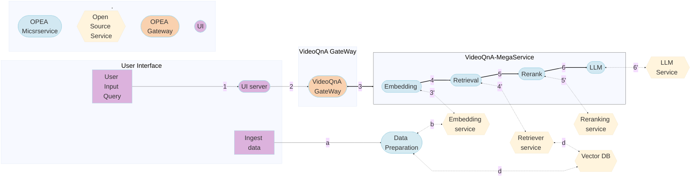

# VideoQnA Application

VideoQnA is a framework that retrieves video based on provided user prompt. It uses only the video embeddings to perform vector similarity search in Intel's VDMS vector database and performs all operations on Intel Xeon CPU. The pipeline supports long form videos and time-based search.

VideoQnA is implemented on top of [GenAIComps](https://github.com/opea-project/GenAIComps), with the architecture flow chart shows below:

- This project implements a Retrieval-Augmented Generation (RAG) workflow using LangChain, Intel VDMS VectorDB, and Text Generation Inference, optimized for Intel Xeon Scalable Processors.
- Video Processing: Videos are converted into feature vectors using mean aggregation and stored in the VDMS vector store.
- Query Handling: When a user submits a query, the system performs a similarity search in the vector store to retrieve the best-matching videos.
- Contextual Inference: The retrieved videos are then sent to the Large Vision Model (LVM) for inference, providing supplemental context for the query.

## Deploy VideoQnA Service

The VideoQnA service can be effortlessly deployed on Intel Xeon Scalable Processors.

### Required Models

By default, the embedding and LVM models are set to a default value as listed below:

| Service   | Model                        |
| --------- | ---------------------------- |
| Embedding | openai/clip-vit-base-patch32 |
| LVM       | DAMO-NLP-SG/Video-LLaMA      |

### Deploy VideoQnA on Xeon

For full instruction of deployment, please check [Guide](docker_compose/intel/cpu/xeon/README.md)

Currently we support deploying VideoQnA services with docker compose, using the docker images `built from source`. Find the corresponding [compose.yaml](docker_compose/intel/cpu/xeon/compose.yaml).

## Fine-Tuning the vCLIP Model for Video Retrieval
To fine-tune the [vCLIP](https://github.com/opea-project/GenAIComps/blob/main/comps/dataprep/vdms/multimodal_langchain/utils/vclip.py) model for video retrieval, you will use a dataset like [ActivityNet Captions](https://huggingface.co/datasets/HuggingFaceM4/ActivitiyNet_Captions), which contains video clips with corresponding textual descriptions. The vCLIP model operates by aggregating frame-level embeddings from individual frames of a video, using the CLIP model to form a video-level representation.

### Steps for Fine-Tuning:
1. Dataset Preparation:

- Extract video frames from each clip in the dataset.
- Convert the frames into embeddings using a pre-trained CLIP model. These embeddings are then mean-aggregated to form a single embedding for the entire video.

2. Model Architecture:

- The vCLIP model leverages the CLIP model's embedding capabilities. For fine-tuning, a contrastive learning approach is commonly applied, where video embeddings are matched with their corresponding text descriptions.
- Refer to the [vclip.py](https://github.com/opea-project/GenAIComps/blob/main/comps/dataprep/vdms/multimodal_langchain/utils/vclip.py) for model definition.

3. Fine-Tuning Procedure:

- Fine-tune the vCLIP model by optimizing it to align video embeddings with their corresponding text embeddings.
- Contrastive loss is typically used to maximize similarity between positive pairs (video and matching caption) while minimizing similarity with non-matching captions.
- Leverage sample fine-tuning code for models like CLIP from the Hugging Face library.

4. Using the Fine-Tuned Model:

- After fine-tuning, replace the base embedding model in your VideoQnA pipeline with the fine-tuned vCLIP model.
- Store the video embeddings in Intel VDMS and use them for retrieval during user queries.
- By following this approach, the fine-tuned vCLIP model will be better equipped to perform video retrieval tasks based on textual descriptions, improving accuracy in VideoQnA.
